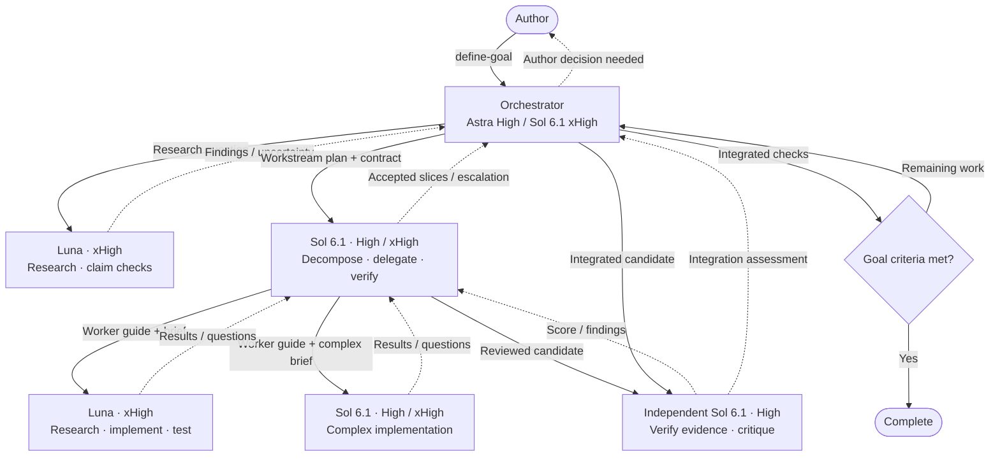
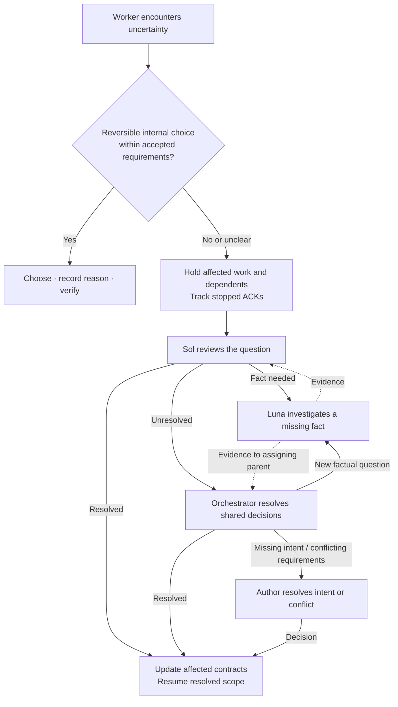
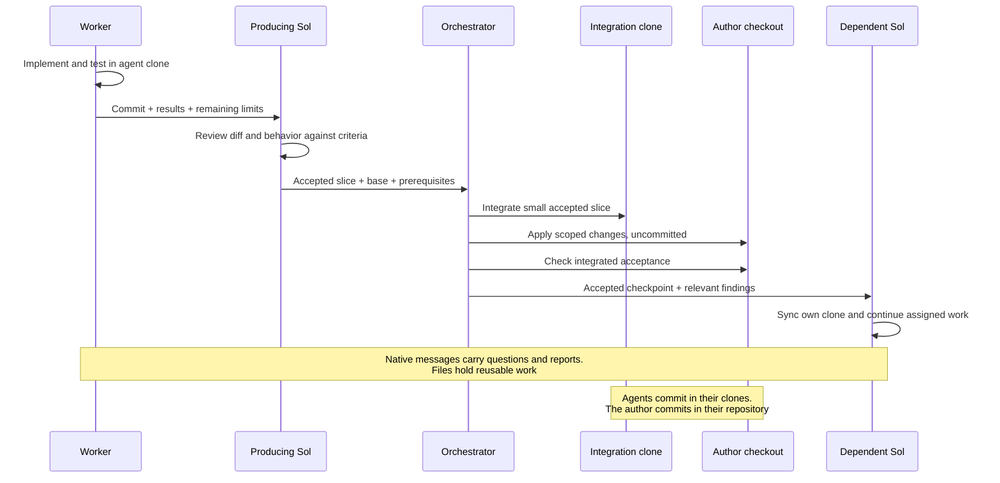

# Orchestrate-work

These Mermaid diagrams summarize [workflow revision 2](../skills/orchestrate-work/SKILL.md).
They inherit the renderer's light or dark theme. Edit the blocks directly;
GitHub renders them in Markdown previews.

## Roles and goal loop

Before dispatch, the orchestrator records the
[workstream plan](../skills/orchestrate-work/references/protocol.md#workstream-plan)
in the existing ledger. `/plan` is optional; when selected, setup and implementation
wait for the host to transition to execution.

Goal setup asks for missing review settings, suggesting 9/10 and three total
assessments. The [review gate](../skills/orchestrate-work/references/protocol.md#review-gate)
requires both the agreed score and all functional/non-functional requirements.
Each verifier is independent of that candidate's implementer and reviewer.
Correct concrete deficiencies within the limit, then hold the failed batch and
its dependents. Routine edits share a batch; passing work proceeds without
another round for optional polish.

Repeat the coordinator and worker branches for each needed workstream. Each Sol
owns an autonomous workstream and reviews its workers against the parent
contract and its derived criteria. Sol implementation workers remain leaves;
research and summaries use Luna, with the skill's bounded trivial-lookup exception. Separate Sol tasks and a top-level goal each
require the author's explicit request. There is no fixed coordinator count;
concurrent coordinators and workers follow runtime capacity, with excess work
queued. xHigh is an effort setting, not a termination guarantee.

## Decisions and scoped holds

Known requirement conflicts go promptly to the author; agents do not repeat
research to avoid that decision. Independent work may continue only when none of
the unresolved alternatives affects it. Only holds require ACKs. An explicit goal
pause stops all goal work. See [uncertainty](../skills/orchestrate-work/references/uncertainty.md)
and [goal lifecycle](../skills/orchestrate-work/references/runtime.md#goals).

## Work and evidence handoff

This sequence shows isolated clone work. Workers may instead share the main
checkout with assigned nonoverlapping scopes; the author's workspace choice prevails.

Workers run local checks, Sol reviews their evidence and behavior, and Orchestrator
checks the integrated result. Repeat checks only when changed inputs or missing
evidence justify it. Research reports can travel independently of code commits.
Receipt, local acceptance, integration and goal acceptance remain distinct.

Use one absolute coordination directory with a compact current ledger and
rewritten workstream state. Archive meaningful history outside the default read
path. Apply pstack-principles throughout and unslop to author-facing prose and
deliverables. See [work protocol](../skills/orchestrate-work/references/protocol.md) and
[Git isolation](../skills/orchestrate-work/references/git.md) for the operational rules.
