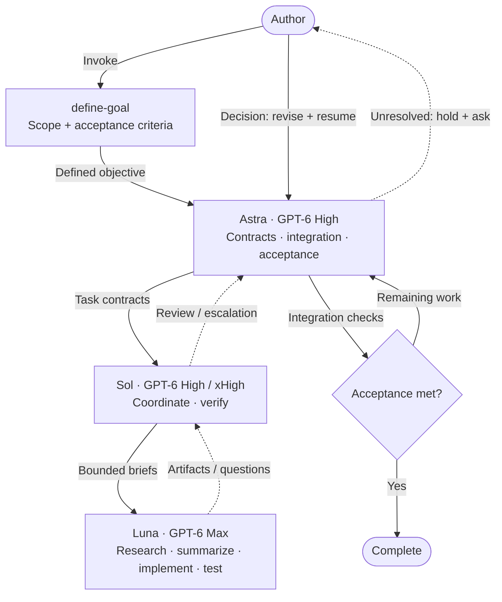
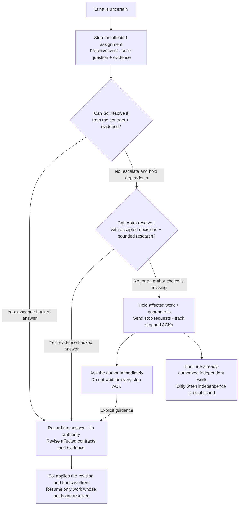
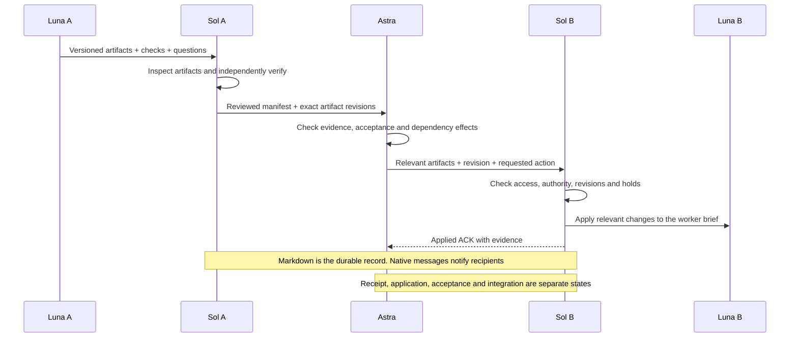

# Orchestrate-work

These diagrams summarize the [skill](../skills/orchestrate-work/SKILL.md).
The [goal lifecycle](../skills/orchestrate-work/references/goals.md),
[uncertainty protocol](../skills/orchestrate-work/references/uncertainty.md), and
[communication protocol](../skills/orchestrate-work/references/communication.md)
define the detailed behavior. Update the affected diagrams when those rules change.

The main view uses one node per role. Each Sol owns a workstream and its own Luna workers. Separate Sol tasks require an explicit request; otherwise the workflow uses subagents. Worker counts follow the actual runtime capacity.

Substantial execution goes to Luna by default. Sol delegates research,
implementation, tests, and documentation while retaining coordination and review.
Astra and Sol record a bounded exception before substantial direct execution;
they queue work when Luna slots are full. See the skill's
[Luna-first execution rule](../skills/orchestrate-work/SKILL.md#luna-first-execution).

## Workflow

Astra creates or reuses a top-level goal only when explicitly requested. Acceptance means every requirement has current evidence, no questions remain unresolved, and no required child work remains. Until then, Astra dispatches ready work and keeps affected dependencies on hold.

## Uncertainty and scoped holds

## Artifact handoffs

All roles apply pstack-principles and unslop. Published Markdown messages and artifacts are versioned; native notifications point to the exact records. A worker being ready does not mean its work has been accepted or integrated.

Goal continuation remains subject to actual runtime and budget limits. A scoped execution hold is distinct from the goal tool's paused or blocked status. An explicit goal pause stops all goal work, including otherwise independent assignments.

Edit the Mermaid blocks in this document directly. GitHub renders them in the
Markdown preview; no image export or plugin is required. The blocks leave theme
selection to the renderer.
